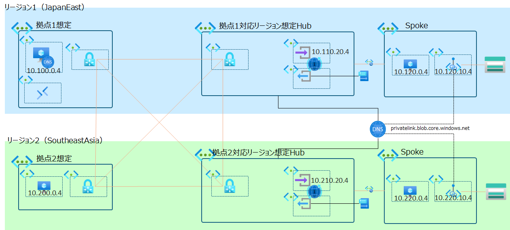
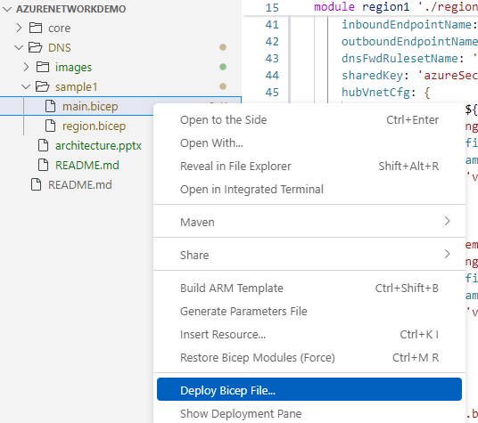

# DNS構成例

Azure におけるDNSの構成例を示します。

## 1.複数拠点・リージョン展開でのDNS構成例

### 前提・制約
- グローバルに展開する複数オンプレミス・データセンター拠点がある
- 各拠点は、拠点に対応する形で最寄りのリージョンにAzureリソースを展開する
- 各リージョンでは Hub ＆ Spokeネットワーク構成を採る
- 各拠点間はWANで接続されており、Azure リージョンへの接続はWANからERで接続する
- 拠点間のルーティング、および拠点-Azure間、Azureリージョン間の通信は、WANでルーティングさせる

### （名前解決の）要件
- 各拠点のクライアントは、拠点内のDNSサーバーを利用して名前解決を行う
- 拠点によっては拠点にDNSサーバーを持たない場合がある。この場合、DNSサーバーを持たない拠点は最寄りの拠点のDNSサーバーを共用する
- Azureリソースの名前解決は、Azureリージョン内のDNSサーバーを利用する
- Azureリージョン間の名前解決は、Azureリージョン内のDNSサーバーを利用する
- Azureから拠点への名前解決は、拠点内のDNSサーバーを利用する
  
### アーキテクチャー
検証のための簡略化したサンプル構成です。

  

### （サンプル構成における）ポイント
- 拠点1、拠点2は、疑似的に仮想ネットワークで構成しています
- 拠点間およびAzureリージョンの接続には、これも疑似的にVPNゲートウェイをVNEt2VNet接続でメッシュに接続し、BGPでルート交換を行う構成としています
- 拠点1にDNSサーバーを構成します。ここでは、test.comのゾーンを持つDNSサーバーを構成し、blob.core.windows.net 宛の名前解決はAzure DNSに転送するように構成しています。
- 拠点2にはDNSサーバーを置かず、拠点1のDNSサーバーを利用するように構成しています。
- Azure上のDNSサーバーとして、リージョン毎にPrivate DNS Resolverを構成しています。test.comの名前解決の転送ルールとして拠点1のネームサーバーを指すように構成しています。
- 各リージョン用にBLOBコンテナーを用意し、Spoke VNetにPrivate EndPointを作成しています。
- BLOB用のPrivate EndPointは、リージョン共通で使用するPrivate DNS Zone（blob.core.windows.net）に登録されています。
- blob.core.windows.netは各リージョンのHub VNetとリンクされています。
- 各Spoke VNetは、Hub VNetとのピアリングを行っており、HubのDNS Resolverのinbound endpointをDNSサーバーとして利用しています。

### サンプル構成のデプロイ手順
./sample1/main.bicep をデプロイします。

#### az CLIの場合

Azureにログインし、デプロイ先サブスクリプションを設定してから、デプロイします。

```bash 
cd sample1
az login
az account set --subscription <サブスクリプション名>
az deployment sub create --location japaneast --template-file 'main.bicep'
```

#### VSCodeの場合
main.bicep を右クリックして、`Deploy to Azure` を選択します。

  
